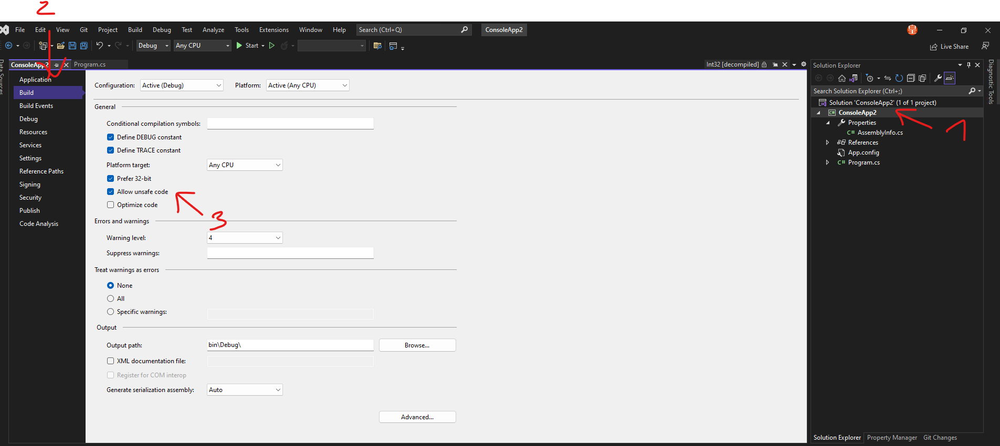
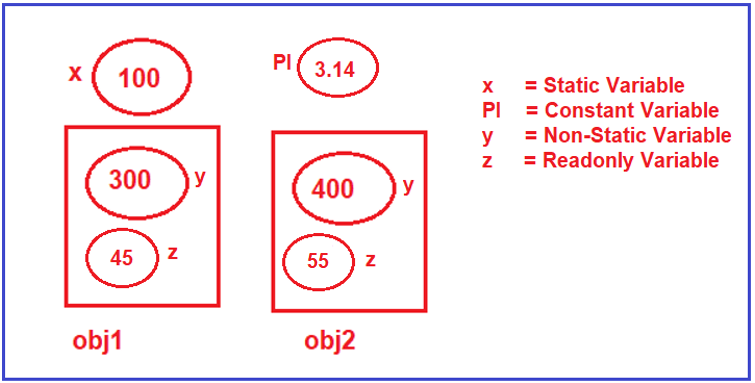

# C\#

<https://dotnettutorials.net/>

## How to Get the Default Values of built-in Data Types in C#?

```c#
Console.WriteLine($"Default Value of Byte: {default(byte)} ");
```

## Explicit Casting

```c#
Console.WriteLine($"Address :{(int)ptr}");
```

## How to run unsafe code in Visual Studio



## Verbatim String Literals

```c#
Console.WriteLine(@"Dot\nNet\tTutorials");
```

=>

```c#
Dot\nNet\tTutorials
```

## TryParse

```c#
bool IsConverted = int.TryParse(str, out int I);
```

## Variables in C\#


