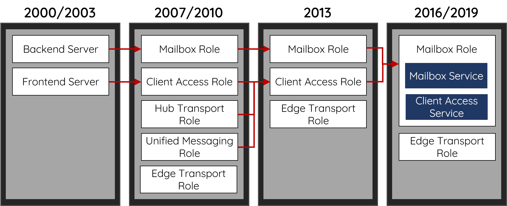

# Exchange Server

2021年8月6日

## I. Exchange Server Architecture



## II. CAS architecture

Client Access Service: CAS. CAS is a fundamental component of Exchange. Back to the version 2000/2003, CAS was an independent Frontend Server in charge of all the Frontend web rendering logics. After several renaming, integrating, and version differences, CAS has been downgraded to a service under the Mailbox Role. The [official documentation from Microsoft](https://docs.microsoft.com/en-us/exchange/architecture/architecture?view=exchserver-2019) indicates that:

> Mailbox servers contain the Client Access services that accept client connections for all protocols. These frontend services are responsible for routing or proxying connections to the corresponding backend services on a Mailbox server
>


CAS Web is built on Microsoft IIS.

There are two websites inside the IIS:

- Default Website: Frontend, port 80, 443
- Exchange Backend: business logic, port 81, 444

All the ports are binding with 0.0.0.0 ⇒ anyone could access the Frontend and Backend directly.


Exchange implements the logic of Frontend and Backend via IIS module.

- The Frontend must contain a Proxy Module. The Proxy Module picks up the HTTP request from the client side and adds some internal settings, then forwards the request to the Backend.
- The Backend, all the applications include the Rehydration Module, which is in charge of parsing Frontend requests, populating the client information back, and continuing to process the business logic.


## III. Frontend Proxy Module

Proxy Module chooses a handler based on the current `ApplicationPath` to process the HTTP request from the client side:

- visiting `/EWS` will use `EwsProxyRequestHandler`
- visiting `/OWA` will use `OwaProxyRequestHandler`
- …

All the handlers in Exchange inherit the class from `ProxyRequestHandler`,its core logic such as:

- how to deal with the HTTP request from the user
- which URL from Backend to proxy to
- how to synchronize the information with the Backend

We will separate `ProxyRequestHandler` into 3 sections:

- Request section: parse the HTTP request from the client and determine which cookie and header could be proxied to the Backend.
- Proxy section
- Response section: receives the response from the Backend and decides which headers or cookies are allowed to be sent back to the Frontend.


### 1. Frontend Request Section

Parse the HTTP request from the client and determine which cookie and header could be proxied to the Backend.

Frontend and Backend relied on HTTP Headers to synchronize information and proxy internal status. Therefore, Exchange has defined a blacklist to avoid some internal Headers being misused (ignorecase):

- X-CommonAccessToken
- X-IsFromCafe
- X-SourceCafeServer
- msExchProxyUri
- X-MSExchangeActivityCtx
- return-client-request-id
- X-Forwarded-For
- X-Backend-Diag-*

**************HttpProxy\ProxyRequestHandler.cs**************

```csharp
protected virtual bool ShouldCopyHeaderToServerRequest(string headerName) {
  return !string.Equals(headerName, "X-CommonAccessToken", OrdinalIgnoreCase) 
      && !string.Equals(headerName, "X-IsFromCafe", OrdinalIgnoreCase) 
      && !string.Equals(headerName, "X-SourceCafeServer", OrdinalIgnoreCase) 
      && !string.Equals(headerName, "msExchProxyUri", OrdinalIgnoreCase) 
      && !string.Equals(headerName, "X-MSExchangeActivityCtx", OrdinalIgnoreCase) 
      && !string.Equals(headerName, "return-client-request-id", OrdinalIgnoreCase) 
      && !string.Equals(headerName, "X-Forwarded-For", OrdinalIgnoreCase) 
      && (!headerName.StartsWith("X-Backend-Diag-", OrdinalIgnoreCase) 
      || this.ClientRequest.GetHttpRequestBase().IsProbeRequest());
}
```

Trong các bước cuối cùng của `Request Section` , Proxy Module sẽ gọi hàm `AddProtocolSpecificHeadersToServerRequest` để thêm HTTP header với mục đích giao tiếp với Backend, ex:

- Thông tin về user hiện tại sẽ được serialize để đưa vào header `X-CommonAccessToken`


### 2. Frontend Proxy Section

`GetTargetBackendServerURL`: calculate which Backend URL should the HTTP request be forwarded to.

`CreateServerRequest`: initialize a new HTTP Client request:

**HttpProxy\ProxyRequestHandler.cs**

```csharp
protected HttpWebRequest CreateServerRequest(Uri targetUrl) {
    HttpWebRequest httpWebRequest = (HttpWebRequest)WebRequest.Create(targetUrl);
    if (!HttpProxySettings.UseDefaultWebProxy.Value) {
        httpWebRequest.Proxy = NullWebProxy.Instance;
    }
    httpWebRequest.ServicePoint.ConnectionLimit = HttpProxySettings.ServicePointConnectionLimit.Value;
    httpWebRequest.Method = this.ClientRequest.HttpMethod;
    httpWebRequest.Headers["X-FE-ClientIP"] = ClientEndpointResolver.GetClientIP(SharedHttpContextWrapper.GetWrapper(this.HttpContext));
    httpWebRequest.Headers["X-Forwarded-For"] = ClientEndpointResolver.GetClientProxyChainIPs(SharedHttpContextWrapper.GetWrapper(this.HttpContext));
    httpWebRequest.Headers["X-Forwarded-Port"] = ClientEndpointResolver.GetClientPort(SharedHttpContextWrapper.GetWrapper(this.HttpContext));
    httpWebRequest.Headers["X-MS-EdgeIP"] = Utilities.GetEdgeServerIpAsProxyHeader(SharedHttpContextWrapper.GetWrapper(this.HttpContext).Request);
    
    // ...
    
    return httpWebRequest;
}
```

Client request proxied to the Backend will be added with several HTTP Headers for internal use. The two most essential Headers are:

- `X-CommonAccessToken`: indicates the mail users’ log in identity.
- `Authorization`: Kerberos Ticket, which represents legal access from the Frontend.


**HttpProxy\ProxyRequestHandler.cs**

```csharp
if (this.ProxyKerberosAuthentication) {
    serverRequest.ConnectionGroupName = this.ClientRequest.UserHostAddress + ":" + GccUtils.GetClientPort(SharedHttpContextWrapper.GetWrapper(this.HttpContext));
} else if (this.AuthBehavior.AuthState == AuthState.BackEndFullAuth || this.
    ShouldBackendRequestBeAnonymous() || (HttpProxySettings.TestBackEndSupportEnabled.Value  
    && !string.IsNullOrEmpty(this.ClientRequest.Headers["TestBackEndUrl"]))) {
    serverRequest.ConnectionGroupName = "Unauthenticated";
} else {
    serverRequest.Headers["Authorization"] = KerberosUtilities.GenerateKerberosAuthHeader(
        serverRequest.Address.Host, this.TraceContext, 
        ref this.authenticationContext, ref this.kerberosChallenge);
}
```

**HttpProxy\KerberosUtilities.cs**

```csharp
internal static string GenerateKerberosAuthHeader(string host, int traceContext, ref AuthenticationContext authenticationContext, ref string kerberosChallenge) {
    byte[] array = null;
    byte[] bytes = null;
    // ...
    authenticationContext = new AuthenticationContext();
    string text = "HTTP/" + host;
    authenticationContext.InitializeForOutboundNegotiate(AuthenticationMechanism.Kerberos, text, null, null);
    SecurityStatus securityStatus = authenticationContext.NegotiateSecurityContext(inputBuffer, out bytes);
    // ...
    string @string = Encoding.ASCII.GetString(bytes);
    return "Negotiate " + @string;
}
```

### 3. Frontend Response Section

Receives the response from the Backend and decides which headers or cookies are allowed to be sent back to the Frontend.

## III. Backend Rehydration Module

1. Method `IsAuthenticated`: check whether the incoming request is authenticated.
2. whether the request is equipped with an extended right called `ms-Exch-EPI-Token-Serialization`. With the default setting, only Exchange Machine Account would have such authorization.

After passing the check, Exchange will restore the login identity used in the Frontend, through deserializing the header `X-CommonAccessToken`
 back to the original Access Token, and then put it in the `httpContext`
 object to progress to the business logic in the Backend.

**Authentication\BackendRehydrationModule.cs**

```csharp
private void OnAuthenticateRequest(object source, EventArgs args) {
    if (httpContext.Request.IsAuthenticated) {
        this.ProcessRequest(httpContext);
    }
}

private void ProcessRequest(HttpContext httpContext) {
    CommonAccessToken token;
    if (this.TryGetCommonAccessToken(httpContext, out token)) {
        // ...
    }
}

private bool TryGetCommonAccessToken(HttpContext httpContext, out CommonAccessToken token) {
    string text = httpContext.Request.Headers["X-CommonAccessToken"];
    if (string.IsNullOrEmpty(text)) {
        return false;
    }
        
    bool flag;
    try {
        flag = this.IsTokenSerializationAllowed(httpContext.User.Identity as WindowsIdentity);
    } finally {
        httpContext.Items["BEValidateCATRightsLatency"] = stopwatch.ElapsedMilliseconds - elapsedMilliseconds;
    }

    token = CommonAccessToken.Deserialize(text);
    httpContext.Items["Item-CommonAccessToken"] = token;
    
    //...
}

private bool IsTokenSerializationAllowed(WindowsIdentity windowsIdentity) {
   flag2 = LocalServer.AllowsTokenSerializationBy(clientSecurityContext);
   return flag2;
}

private static bool AllowsTokenSerializationBy(ClientSecurityContext clientContext) {
    return LocalServer.HasExtendedRightOnServer(clientContext, 
        WellKnownGuid.TokenSerializationRightGuid);  // ms-Exch-EPI-Token-Serialization

}
```
