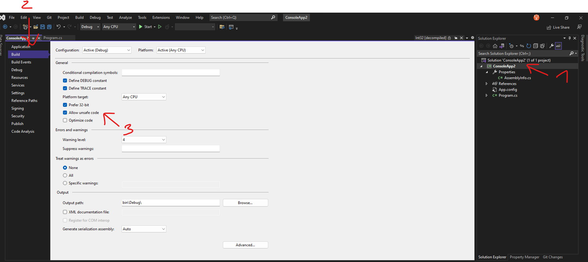
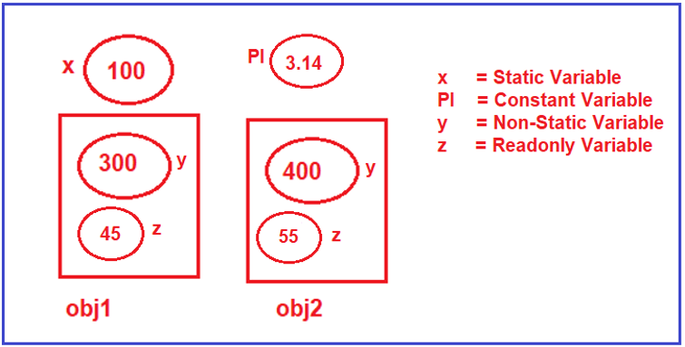

# C\#

<https://dotnettutorials.net/>

## How to Get the Default Values of built-in Data Types in C#?

```c#
Console.WriteLine($"Default Value of Byte: {default(byte)} ");
```

## Explicit Casting

```c#
Console.WriteLine($"Address :{(int)ptr}");
```

## How to run unsafe code in Visual Studio



## Verbatim String Literals

```c#
Console.WriteLine(@"Dot\nNet\tTutorials");
```

=>

```c#
Dot\nNet\tTutorials
```

## TryParse

```c#
bool IsConverted = int.TryParse(str, out int I);
```

## Variables in C\#



## ILDASM tool

The ILDASM (IL  Disassembler ) is a great tool for those who want to take an insight look of IL code. This tool is used to view the assembly content for all the code components.  This tool is installed with your Visual Studio and in a traditional way, can be accessed from the Visual Studio Command Prompt.  In this post, you will learn how you can open the same tool inside Visual Studio by using a shortcut key.

<https://dailydotnettips.com/did-you-know-you-can-launch-ildasm-tool-from-inside-visual-studio-itself-how/>

## Auto Implemented Properties

When we create Auto Implemented Properties, behind the scene, the compiler will create the private anonymous field for each property to hold the data.

```c#
using System;
namespace PropertyDemo
{
    public class Employee
    {
        public int Id { get; set; }
        public int Age { get; set; }
        public string Name { get; set; }
        public string Address { get; set; }
    }
    class Program
    {
        static void Main(string[] args)
        {
            Employee employee = new Employee();
            employee.Id = 101;
            employee.Age = 101;
            employee.Name = "Pranaya";
            employee.Address = "BBSR, Odisha, India";
            Console.WriteLine("Employee Details:");
            Console.WriteLine($"Id: {employee.Id}");
            Console.WriteLine($"Name: {employee.Name}");
            Console.WriteLine($"Age: {employee.Age}");
            Console.WriteLine($"Address: {employee.Address}");
            Console.ReadKey();
        }
    }
}
```

## Private Constructor Use Case

The use case of Private Constructor in C# is that if you don’t want your class to be instantiated from outside the class, then add a private constructor without any public constructor in your class.

used to implement Singleton Design Pattern

## Explicit calling of the garbage collector

```c#
using System;
namespace DestructorExample
{
    class DestructorDemo
    {
        public DestructorDemo()
        {
            Console.WriteLine("Constructor Object Created");
        }
        ~DestructorDemo()
        {
            string type = GetType().Name;
            Console.WriteLine($"Object {type} is Destroyed");
        }
    }
    class Program
    {
        static void Main(string[] args)
        {
            DestructorDemo obj1 = new DestructorDemo();
            DestructorDemo obj2 = new DestructorDemo();
            //Making obj1 for Garbage Collection
            obj1 = null;
            GC.Collect();
            Console.ReadKey();
        }
    }
}
```
