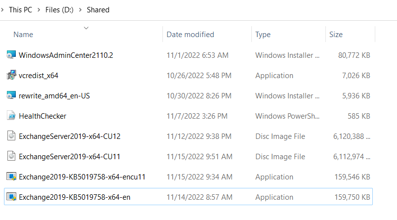

# Lab Setup

Sử dụng Vmware Workstation Pro

# I. Tạo template

Template là những máy cơ bản dùng để clone ra những máy khác dùng sau này

## 1. Windows Server 2022 Standard: Template WS22 Standard

Hardware:

- Ram: 2GB
- Processors: 4x1 (processors x cores)
- Hard disk: 60GB

Install VMware Tools and manually shutdown. Take snapshot 'fresh’.

## 2. Windows Server 2022 Standard Desktop Experience: Template WS22 Standard Desktop

Hardware:

- Ram: 8GB
- Processors: 4x2 (processors x cores)
- Hard disk: 60GB

Install VMware Tools and manually shutdown. Take snapshot 'fresh’.

# II. Lab setup

## 1. Windows Server 2022 Standard cho Active Directory

Link clone from Template WS22 Standard tại snapshot ‘fresh’.

### Static ip address

sconfig:

- 8) Network settings
- Select network adapter index: 1
- 1) Set network adapter address
- Select (S)tatic IP Address: S
- Enter static IP address: {AD IP address}
- Enter default gateway: not change

### DNS Server ip address

Có thể cài thủ công bằng sconfig, nhưng nó sẽ được tự động cài thành [localhost](http://localhost) sau câu lệnh cài AD ở dưới.

### Computer name

sconfig:

- 2) Computer name:
- ‘WS22-AD’

Shutdown và tạo snapshot.

### Install DNS Server and Active Directory

```powershell
Install-WindowsFeature AD-Domain-Services -IncludeManagementTools
Import-Module ADDSDeployment
Install-ADDSForest `
-CreateDnsDelegation:$false `
-DatabasePath "C:\Windows\NTDS" `
-DomainMode "WinThreshold" `
-DomainName "exchangelab.local" `
-DomainNetbiosName "EXCHANGELAB" `
-ForestMode "WinThreshold" `
-InstallDns:$true `
-LogPath "C:\Windows\NTDS" `
-NoRebootOnCompletion:$true `
-SysvolPath "C:\Windows\SYSVOL" `
-Force:$true
```

Shutdown and take snapshot `installed dns server, ad`

### 2. Windows Server 2022 Standard Desktop cho Exchange Server

Link clone from Template WS22 Standard Desktop tại snapshot ‘fresh’.

### Static ip address

sconfig:

- 8) Network settings
- Select network adapter index: 1
- 1) Set network adapter address
- Select (S)tatic IP Address: S
- Enter static IP address: {ES IP address}
- Enter default gateway: not change

### DNS Server ip address

Sử dụng DNS Server của máy trên.

sconfig:

- 8) Network settings
- Select network adapter index: 1
- Set DNS servers
- Enter new preferred DNS server (Blank=Cancel): {AD IP address}
- Enter alternate DNS server (Blank=None): Blank

### Join domain and change computer’s name

```powershell
Add-Computer -DomainName exchangelab.local -NewName WS22-ES19CU11 -DomainCredential exchangelab\administrator
```

### **VMware Shared Folders**

Chọn always enable shared folder và chia sẻ qua network trong settings của từng máy ảo vmware. Sau đó có thể truy cập vào file từ máy ảo qua đường dẫn `\\\\vmware-host\\Shared Folders\\`




### Preinstall

login as SEADRAGNOL\Administrator

```powershell
PS C:\Users\Administrator.EXCHANGELAB> Install-WindowsFeature Server-Media-Foundation, NET-Framework-45-Features, RPC-over-HTTP-proxy, RSAT-Clustering, RSAT-Clustering-CmdInterface, RSAT-Clustering-PowerShell, WAS-Process-Model, Web-Asp-Net45, Web-Basic-Auth, Web-Client-Auth, Web-Digest-Auth, Web-Dir-Browsing, Web-Dyn-Compression, Web-Http-Errors, Web-Http-Logging, Web-Http-Redirect, Web-Http-Tracing, Web-ISAPI-Ext, Web-ISAPI-Filter, Web-Metabase, Web-Mgmt-Service, Web-Net-Ext45, Web-Request-Monitor, Web-Server, Web-Stat-Compression, Web-Static-Content, Web-Windows-Auth, Web-WMI, RSAT-ADDS
>> Install-WindowsFeature Web-Server -IncludeManagementTools

Success Restart Needed Exit Code      Feature Result
------- -------------- ---------      --------------
True    No             Success        {Message Queuing, Message Queuing Server, ...
True    No             Success        {IIS Management Console}

PS C:\Users\Administrator.EXCHANGELAB> cd \\vmware-host\'Shared Folders'\Shared
PS Microsoft.PowerShell.Core\FileSystem::\\vmware-host\Shared Folders\Shared> ls

    Directory: \\vmware-host\Shared Folders\Shared

Mode                 LastWriteTime         Length Name
----                 -------------         ------ ----
-a----        11/13/2022   5:57 PM      163583472 Exchange2019-KB5019758-x64-en.exe
-a----        11/14/2022   6:34 PM      163374576 Exchange2019-KB5019758-x64-encu11.exe
-a----        11/14/2022   6:51 PM     6259685376 ExchangeServer2019-x64-CU11.ISO
-a----        11/12/2022   6:38 AM     6267277312 ExchangeServer2019-x64-CU12.ISO
-a----         11/7/2022  12:26 AM         598251 HealthChecker.ps1
-a----        10/30/2022   6:26 AM        6078464 rewrite_amd64_en-US.msi
-a----        10/26/2022   3:48 AM        7194312 vcredist_x64.exe
-a----        10/31/2022   4:53 PM       82710528 WindowsAdminCenter2110.2.msi

PS Microsoft.PowerShell.Core\FileSystem::\\vmware-host\Shared Folders\Shared> cp .\ExchangeServer2019-x64-CU11.ISO C:\Users\Administrator\Documents\
PS Microsoft.PowerShell.Core\FileSystem::\\vmware-host\Shared Folders\Shared> .\rewrite_amd64_en-US.msi
PS Microsoft.PowerShell.Core\FileSystem::\\vmware-host\Shared Folders\Shared> .\vcredist_x64.exe
PS Microsoft.PowerShell.Core\FileSystem::\\vmware-host\Shared Folders\Shared> Mount-DiskImage C:\Users\Administrator\Documents\ExchangeServer2019-x64-CU11.ISO

Attached          : True
BlockSize         : 0
DevicePath        : \\.\CDROM1
FileSize          : 6259685376
ImagePath         : C:\Users\Administrator\Documents\ExchangeServer2019-x64-CU11.ISO
LogicalSectorSize : 2048
Number            : 1
Size              : 6259685376
StorageType       : 1
PSComputerName    :

PS Microsoft.PowerShell.Core\FileSystem::\\vmware-host\Shared Folders\Shared> E:\UCMARedist\Setup.exe
```

Shutdown, take snapshot `installed prerequisite es19`

### Install Exchange Server

```powershell
PS C:\Users\Administrator.EXCHANGELAB> Mount-DiskImage C:\Users\Administrator\Documents\ExchangeServer2019-x64-CU11.ISO

Attached          : True
BlockSize         : 0
DevicePath        : \\.\CDROM1
FileSize          : 6259685376
ImagePath         : C:\Users\Administrator\Documents\ExchangeServer2019-x64-CU11.ISO
LogicalSectorSize : 2048
Number            : 1
Size              : 6259685376
StorageType       : 1
PSComputerName    :

PS C:\Users\Administrator.EXCHANGELAB> E:\Setup.exe /m:install /roles:m /IAcceptExchangeServerLicenseTerms_DiagnosticDataON /OrganizationName:"exchangelab"

```

## III Một số lỗi

### DHCP release

[fix video](https://www.youtube.com/watch?v=uFgsDDd7dTo&ab_channel=NetITGeeks)

- Remove-NetIpAddress -InterfaceAlias Ethernet0 -confirm:$False
- New-NetIpAddress -InterfaceAlias Ethernet0 -IpAddress 192.168.1.x -PrefixLength 24 -DefaultGateway 192.168.1.1
